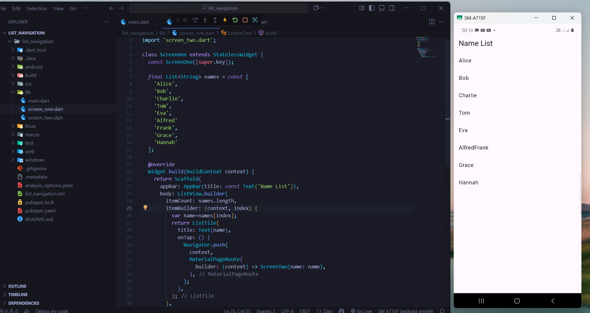
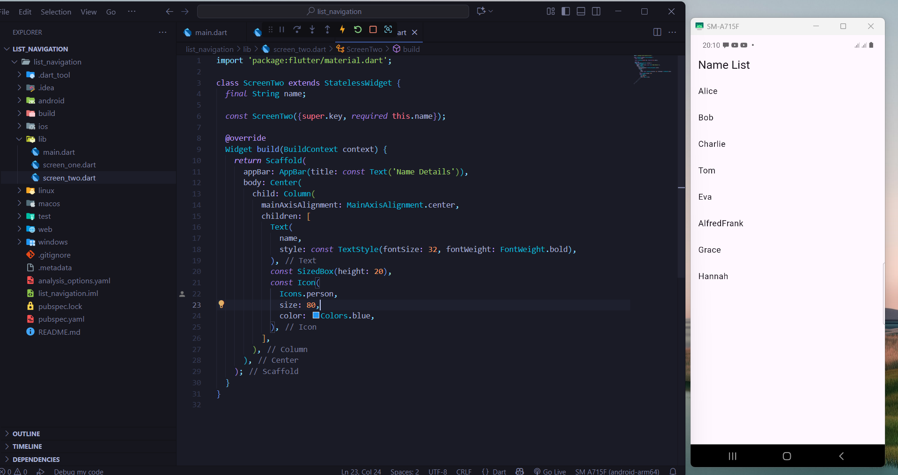
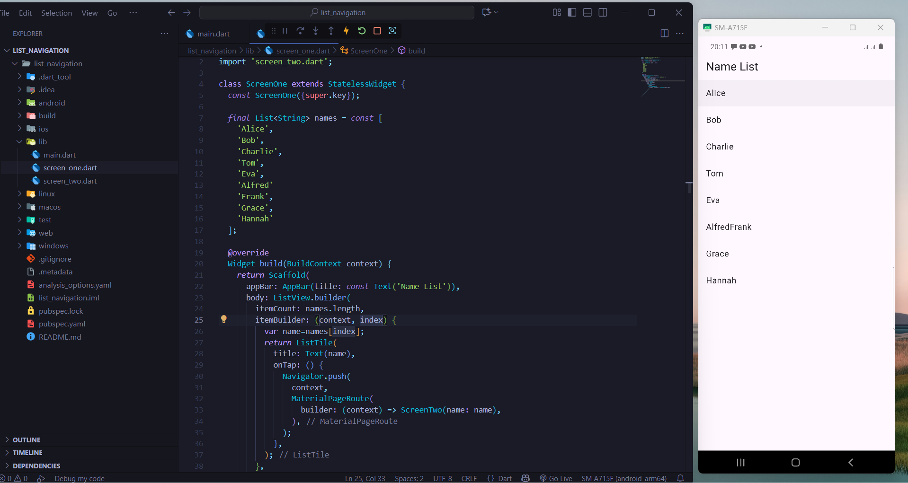
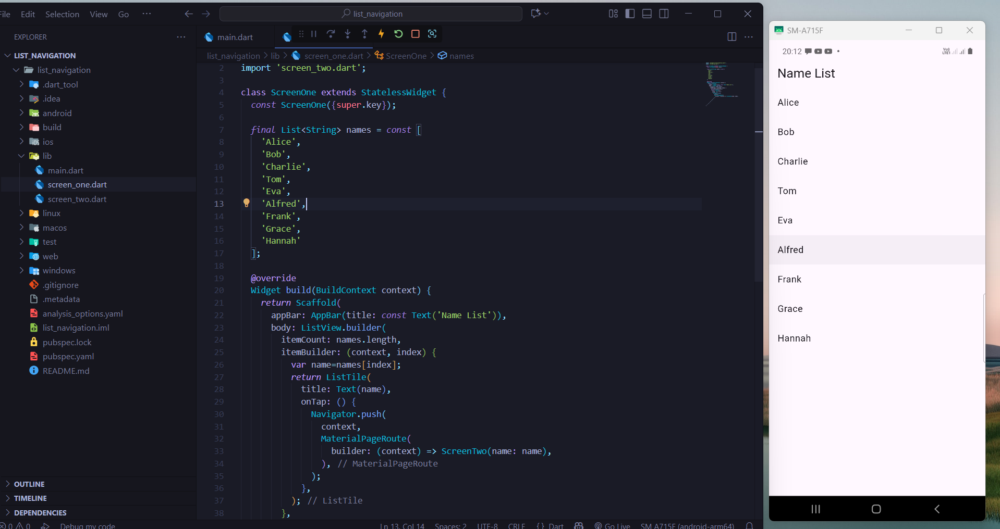
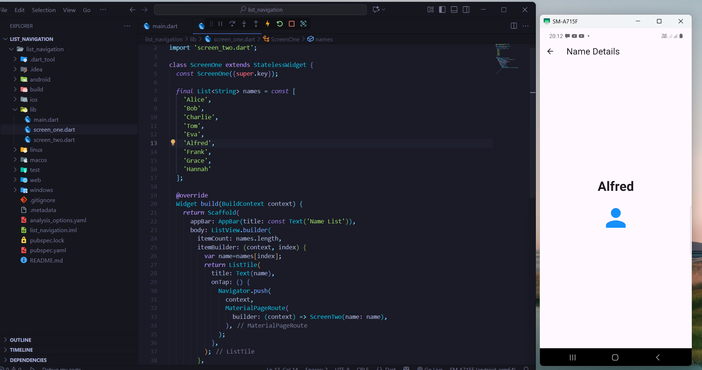

# Flutter List Navigation App

A simple Flutter app demonstrating **ListView navigation** between two screens.

---

## Features

- List of names displayed using `ListView.builder`
- Tap a name to navigate to a detail screen using `Navigator.push`
- Detail screen shows the tapped name and a person icon
- Minimal and clean UI

---

## Screenshots

*Code implementation of Screen One*
  


*Code implementation of Screen Two*
  


*3*
  


*4*
  

*5*
  

*6*
  

---

## Running Instructions

1. **Clone the repository:**

```bash
git clone https://github.com/ajlank/flutter-list-navigation.git
cd list_navigation
flutter run
